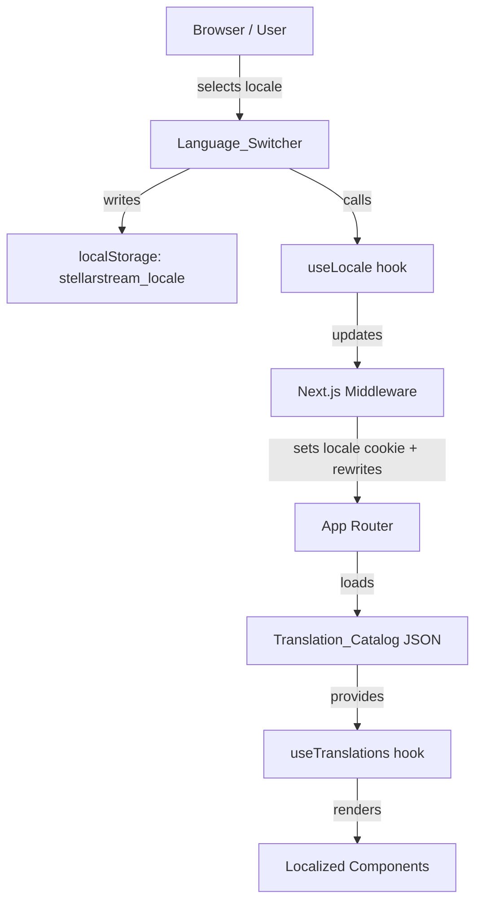

# Design Document: Global Flow i18n

## Overview

This document describes the technical design for adding internationalization (i18n) support to the StellarStream Next.js frontend. The implementation uses **next-intl** — the idiomatic i18n library for the Next.js App Router — to serve translated strings from JSON catalogs, persist locale preferences in `localStorage`, and render a glass-style language switcher in the footer.

Initial supported locales: English (`en`), Spanish (`es`), French (`fr`), Portuguese (`pt`).

---

## Architecture

The i18n system is layered as follows:



**Key decisions:**
- `next-intl` is chosen over `next-i18next` because it has first-class App Router support (Server Components, Client Components, middleware-based routing).
- Locale is stored in both a cookie (for SSR) and `localStorage` (for persistence across cold loads).
- The `[locale]` dynamic segment pattern is used for URL-based locale routing (e.g., `/en/dashboard`, `/es/dashboard`), with a middleware redirect from `/` to the detected locale.
- All translation catalogs live in `public/locales/{locale}/common.json`.

---

## Components and Interfaces

### New Files

| File | Purpose |
|---|---|
| `frontend/i18n.ts` | next-intl configuration: supported locales, default locale |
| `frontend/middleware.ts` | Locale detection, cookie setting, URL rewriting |
| `frontend/app/[locale]/layout.tsx` | Locale-aware root layout (replaces `app/layout.tsx`) |
| `frontend/components/language-switcher.tsx` | Glass-style dropdown for locale selection |
| `frontend/lib/locale-utils.ts` | Helpers: `getStoredLocale`, `setStoredLocale`, `detectBrowserLocale` |
| `public/locales/en/common.json` | English translation catalog |
| `public/locales/es/common.json` | Spanish translation catalog |
| `public/locales/fr/common.json` | French translation catalog |
| `public/locales/pt/common.json` | Portuguese translation catalog |

### Modified Files

| File | Change |
|---|---|
| `frontend/next.config.ts` | Add `next-intl` plugin |
| `frontend/app/layout.tsx` | Wrap with `NextIntlClientProvider`, add `lang` attribute |
| `frontend/components/footer.tsx` | Add `LanguageSwitcher`, translate all strings |
| `frontend/components/nav.tsx` | Translate nav labels and button text |
| `frontend/components/landing/hero-section.tsx` | Translate headings and CTAs |
| `frontend/components/landing/feature-bento-section.tsx` | Translate feature data |
| `frontend/components/onboarding/*.tsx` | Translate all user-visible strings |
| `frontend/components/dashboard/sidebar.tsx` | Translate nav labels and wallet card |

### LanguageSwitcher Interface

```typescript
// frontend/components/language-switcher.tsx
interface LanguageSwitcherProps {
  // No required props — reads Active_Locale from next-intl context
}

// Locale display metadata
const LOCALE_LABELS: Record<string, { label: string; nativeLabel: string }> = {
  en: { label: "English",    nativeLabel: "English"    },
  es: { label: "Spanish",    nativeLabel: "Español"    },
  fr: { label: "French",     nativeLabel: "Français"   },
  pt: { label: "Portuguese", nativeLabel: "Português"  },
};
```

### locale-utils Interface

```typescript
// frontend/lib/locale-utils.ts
const SUPPORTED_LOCALES = ["en", "es", "fr", "pt"] as const;
type SupportedLocale = typeof SUPPORTED_LOCALES[number];

function getStoredLocale(): SupportedLocale | null
function setStoredLocale(locale: SupportedLocale): void
function detectBrowserLocale(): SupportedLocale
function isSupported(locale: string): locale is SupportedLocale
```

---

## Data Models

### Translation Catalog Schema

Each `common.json` follows a nested namespace structure:

```json
{
  "nav": {
    "about": "About",
    "howItWorks": "How it works",
    "assets": "Assets",
    "faq": "FAQ",
    "connect": "Connect",
    "connected": "Connected"
  },
  "footer": {
    "tagline": "Non-custodial, second-by-second asset streaming protocol built on Soroban. Money as a Stream.",
    "builtOn": "Built on Stellar",
    "poweredBy": "Powered by",
    "copyright": "All rights reserved.",
    "product": "Product",
    "resources": "Resources",
    "company": "Company",
    "legal": "Legal",
    "selectLanguage": "Select language"
  },
  "hero": {
    "badge": "Soroban Protocol • Non-Custodial",
    "headline": "Your keys to real-time asset flow",
    "subheadline": "Replace payroll cliffs with second-by-second liquidity. Funds unlock by ledger timestamp and can be withdrawn anytime.",
    "exploreStreams": "Explore Streams",
    "startStreaming": "Start Streaming"
  },
  "features": {
    "sectionLabel": "Feature Bento",
    "sectionTitle": "Security, Speed, Yield",
    "security": { "label": "Security", "title": "Real-time Settlement", "description": "...", "value": "Second-by-second finality" },
    "speed":    { "label": "Speed",    "title": "Low Fees",             "description": "...", "value": "Optimized for micro-flows" },
    "yield":    { "label": "Yield",    "title": "Auto-Yield",           "description": "...", "value": "Passive return while streaming" }
  },
  "onboarding": {
    "badge": "Identity Glass",
    "headline": "Create Your Identity",
    "subheadline": "Set up your Stellar profile and start streaming value",
    "yourAddress": "Your Stellar Address",
    "displayName": "Display Name",
    "displayNamePlaceholder": "Enter your display name",
    "displayNameHint": "This is how others will see you on Stellar",
    "federatedAddress": "Federated Address (Optional)",
    "federatedAddressHint": "Link a friendly address to your Stellar account",
    "validFederated": "Valid federated address format",
    "profileSummary": "Profile Summary",
    "notSet": "Not set",
    "notLinked": "Not linked",
    "continue": "Continue",
    "completeSetup": "Complete Setup",
    "settingUp": "Setting up...",
    "skipForNow": "Skip for now",
    "securedBy": "Your identity is secured by the Stellar network"
  },
  "dashboard": {
    "navigation": "Navigation Blade",
    "dashboard": "Dashboard",
    "myStreams": "My Streams",
    "createStream": "Create Stream",
    "settings": "Settings",
    "connectedWallet": "Connected Wallet",
    "expandSidebar": "Expand sidebar",
    "collapseSidebar": "Collapse sidebar"
  }
}
```

### Middleware Configuration

```typescript
// frontend/middleware.ts
import createMiddleware from "next-intl/middleware";

export default createMiddleware({
  locales: ["en", "es", "fr", "pt"],
  defaultLocale: "en",
  localeDetection: true,         // reads Accept-Language header
  localePrefix: "as-needed",     // /en/... only when non-default
});

export const config = {
  matcher: ["/((?!api|_next|.*\\..*).*)"],
};
```

---

## Correctness Properties

*A property is a characteristic or behavior that should hold true across all valid executions of a system — essentially, a formal statement about what the system should do. Properties serve as the bridge between human-readable specifications and machine-verifiable correctness guarantees.*

### Property 1: Translation catalog completeness

*For any* supported locale other than `en`, the set of Translation_Keys in that locale's catalog SHALL be a subset of the keys in the `en` catalog (no extra keys, no missing keys relative to `en`).

**Validates: Requirements 2.4**

---

### Property 2: Fallback on missing key

*For any* Translation_Key that exists in the `en` catalog but is absent from another locale's catalog, the i18n_Framework SHALL return the `en` string rather than an empty string or the raw key.

**Validates: Requirements 1.5, 2.5**

---

### Property 3: Locale persistence round-trip

*For any* supported locale `L`, calling `setStoredLocale(L)` followed by `getStoredLocale()` SHALL return `L`.

**Validates: Requirements 3.1, 3.2**

---

### Property 4: Browser locale detection maps to supported locale

*For any* `navigator.language` value, `detectBrowserLocale()` SHALL return a value that is a member of `["en", "es", "fr", "pt"]`.

**Validates: Requirements 3.3, 3.4**

---

### Property 5: `isSupported` is consistent with SUPPORTED_LOCALES

*For any* string `s`, `isSupported(s)` SHALL return `true` if and only if `s` is a member of `SUPPORTED_LOCALES`.

**Validates: Requirements 1.2**

---

### Property 6: `lang` attribute reflects Active_Locale

*For any* supported locale `L` set as the Active_Locale, the root `<html>` element's `lang` attribute SHALL equal `L`.

**Validates: Requirements 6.1**

---

## Error Handling

| Scenario | Behavior |
|---|---|
| Missing catalog file | Fall back to `en` catalog; log `[i18n] Missing catalog for locale: {locale}` |
| Malformed JSON catalog | Fall back to `en` catalog; log `[i18n] Failed to parse catalog for locale: {locale}` |
| Unknown Translation_Key | Return the key string itself (next-intl default); log warning in development |
| Unsupported locale in URL | Middleware redirects to `/en/...` |
| `localStorage` unavailable (SSR) | Skip read/write; rely on cookie-based locale from middleware |

---

## Testing Strategy

### Unit Tests (Vitest)

- `locale-utils.ts`: test `getStoredLocale`, `setStoredLocale`, `detectBrowserLocale`, `isSupported` with mocked `localStorage` and `navigator.language`.
- `LanguageSwitcher`: test rendering, dropdown open/close, locale selection, keyboard navigation (Escape closes, focus trap).
- Catalog completeness: load all four JSON files and assert key sets match.

### Property-Based Tests (fast-check)

Each property from the Correctness Properties section maps to one property-based test using **fast-check**.

- Minimum **100 iterations** per property test.
- Tag format: `Feature: global-flow-i18n, Property {N}: {property_text}`

**Property test configuration:**

```typescript
// vitest.config.ts — no changes needed; fast-check works with Vitest out of the box
import * as fc from "fast-check";

// Example: Property 3
test("locale persistence round-trip", () => {
  // Feature: global-flow-i18n, Property 3: locale persistence round-trip
  fc.assert(
    fc.property(fc.constantFrom("en", "es", "fr", "pt"), (locale) => {
      setStoredLocale(locale);
      return getStoredLocale() === locale;
    }),
    { numRuns: 100 }
  );
});
```

### Integration Tests

- Render `<Footer />` with each locale and assert translated strings appear.
- Render `<Nav />` with each locale and assert nav labels are translated.
- Render `<HeroSection />` with each locale and assert headline is translated.
