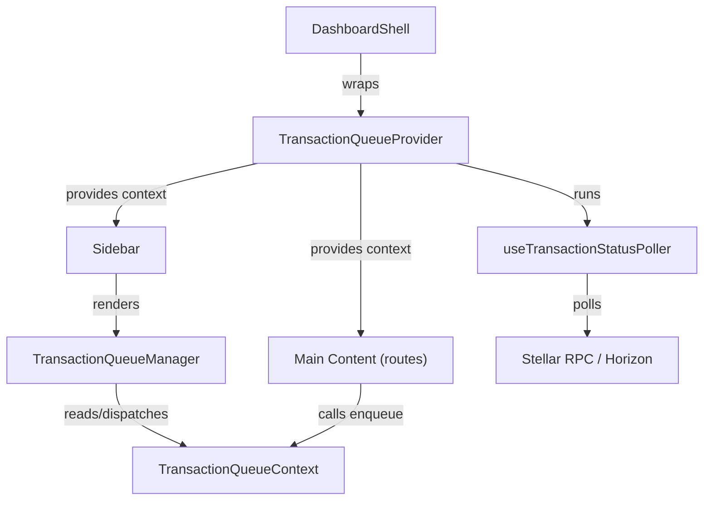

# Design Document: Transaction Queue Manager

## Overview

The Transaction Queue Manager introduces UI parallelism for in-flight Stellar blockchain transactions. Today, a pending withdrawal blocks the user from initiating further transactions. This feature adds a persistent, footer-mounted queue panel inside the existing `Sidebar` that tracks multiple simultaneous in-flight transactions, displays live status, and lets users continue interacting with the dashboard without waiting for prior transactions to confirm.

The implementation is purely client-side. No backend changes are required. State is held in a React context mounted above the route tree so navigation never unmounts the queue. Session storage provides persistence across browser refreshes.

---

## Architecture

The feature is composed of three layers:

1. **State layer** — `TransactionQueueContext` (a React context + reducer) mounted in `DashboardShell`, above the route tree. Exposes `useTransactionQueue()` hook to any component in the dashboard.
2. **UI layer** — `TransactionQueueManager` component rendered inside the `Sidebar` footer (desktop) and the mobile bottom bar (mobile). Reads from and dispatches to the context.
3. **Polling layer** — A lightweight status-polling hook (`useTransactionStatusPoller`) that runs inside the context provider and updates entry statuses by querying the Stellar RPC server.



### Key Design Decisions

- **Context over Zustand/Redux**: The existing codebase already uses React context (`StellarProvider`, `useWallet`). Adding another context keeps the pattern consistent and avoids a new dependency.
- **Reducer pattern**: Queue mutations (enqueue, update status, dismiss) are modelled as a reducer for predictable state transitions and easy testing.
- **Session storage, not local storage**: Pending transactions are only relevant for the current browser session. Session storage is cleared automatically when the tab closes, avoiding stale entries on next login.
- **Polling over WebSocket subscriptions**: Stellar Horizon supports event streaming, but polling every 3 seconds is simpler, more resilient to network interruptions, and sufficient for the ≤5 second update requirement.
- **No blocking**: `enqueue` is a fire-and-forget dispatch. Callers never await queue state.

---

## Components and Interfaces

### `TransactionQueueProvider`

A React context provider wrapping `DashboardShell`'s children. Holds the queue reducer state and runs the status poller.

```tsx
// Mounting point: frontend/components/dashboard/dashboard-shell.tsx
<TransactionQueueProvider>
  <Sidebar ... />
  <main>...</main>
</TransactionQueueProvider>
```

### `useTransactionQueue()`

The public hook consumed by any component that needs to enqueue a transaction or read queue state.

```ts
interface TransactionQueueContextValue {
  entries: TransactionEntry[];
  enqueue: (tx: EnqueuePayload) => string; // returns the new entry's id
  updateStatus: (id: string, status: TransactionStatus, meta?: Partial<TransactionEntry>) => void;
  dismiss: (id: string) => void;
  dismissAllCompleted: () => void;
}
```

### `TransactionQueueManager`

The visual component. Rendered twice in the sidebar tree — once in the desktop sidebar footer, once in the mobile bottom bar — but both instances share the same context state.

Collapsed state (default): shows a compact icon with a `Queue_Badge` count of pending entries.
Expanded state: shows a scrollable list of `TransactionEntryRow` items.

### `TransactionEntryRow`

A single row inside the expanded panel. Renders type label, truncated hash, amount/token (if present), status badge, animated spinner (pending), dismiss button (confirmed/failed), and StellarExpert link.

### `useTransactionStatusPoller`

An internal hook (used only inside `TransactionQueueProvider`) that polls the Stellar RPC for each pending entry's transaction status on a 3-second interval. On confirmation or failure it dispatches `updateStatus`. On poll failure it increments a retry counter and surfaces a retry affordance after 3 consecutive failures.

---

## Data Models

### `TransactionEntry`

Extends the existing `TransactionEvent` shape with queue-specific fields.

```ts
import { TransactionEventType } from "@/components/dashboard/TransactionHistorySidebar";

export type TransactionStatus = "pending" | "confirmed" | "failed";

export interface TransactionEntry {
  // Core identity
  id: string;                        // uuid generated at enqueue time
  type: TransactionEventType;
  hash: string;                      // on-chain tx hash (may be empty string before submission)
  timestamp: number;                 // ms since epoch, set at enqueue time

  // Optional metadata
  sender: string;
  receiver?: string;
  amount?: string;
  token?: string;
  streamId?: string;

  // Queue state
  status: TransactionStatus;
  pollFailureCount: number;          // consecutive poll failures; resets on success
  ledger?: number;
  blockTime?: number;
}
```

### `EnqueuePayload`

The subset of fields a caller must provide when submitting a new transaction.

```ts
export type EnqueuePayload = Pick<
  TransactionEntry,
  "type" | "hash" | "sender"
> & Partial<Pick<TransactionEntry, "receiver" | "amount" | "token" | "streamId">>;
```

### Queue Reducer Actions

```ts
type QueueAction =
  | { type: "ENQUEUE"; payload: TransactionEntry }
  | { type: "UPDATE_STATUS"; id: string; status: TransactionStatus; meta?: Partial<TransactionEntry> }
  | { type: "DISMISS"; id: string }
  | { type: "DISMISS_ALL_COMPLETED" }
  | { type: "HYDRATE"; entries: TransactionEntry[] };   // used on mount from session storage
```

### Session Storage Schema

Key: `txqueue_pending`
Value: JSON array of `TransactionEntry` objects where `status === "pending"`. Only pending entries are persisted (confirmed/failed entries are ephemeral).

```ts
// Serialization
sessionStorage.setItem("txqueue_pending", JSON.stringify(
  entries.filter(e => e.status === "pending")
));

// Hydration on mount
const raw = sessionStorage.getItem("txqueue_pending");
const restored: TransactionEntry[] = raw ? JSON.parse(raw) : [];
dispatch({ type: "HYDRATE", entries: restored });
```

---

## Correctness Properties


*A property is a characteristic or behavior that should hold true across all valid executions of a system — essentially, a formal statement about what the system should do. Properties serve as the bridge between human-readable specifications and machine-verifiable correctness guarantees.*

### Property 1: Enqueue invariants

*For any* valid `EnqueuePayload`, calling `enqueue` must add exactly one new entry to the queue with `status === "pending"`, and any entries that existed before the call must still be present and unchanged afterward.

**Validates: Requirements 2.1, 2.3**

### Property 2: All TransactionEventTypes are accepted

*For any* non-empty list of `EnqueuePayload` objects whose `type` fields cover all eight `TransactionEventType` values, after enqueueing all of them the queue must contain one entry for each payload, each with `status === "pending"`.

**Validates: Requirements 2.2**

### Property 3: Unique entry IDs

*For any* sequence of `enqueue` calls, all returned IDs must be pairwise distinct.

**Validates: Requirements 2.4**

### Property 4: Status update correctness

*For any* entry in the queue and any terminal status (`"confirmed"` or `"failed"`), calling `updateStatus(id, status)` must set that entry's `status` to the given value while leaving all other entries unchanged.

**Validates: Requirements 3.1, 3.2**

### Property 5: Poll failure retention

*For any* pending entry, when a simulated poll failure occurs (i.e., `updateStatus` is not called), the entry must remain in the queue at its last known status and its `pollFailureCount` must increment by one.

**Validates: Requirements 3.4**

### Property 6: Entry row renders required fields

*For any* `TransactionEntry`, the rendered `TransactionEntryRow` must include the type label, a truncated form of the hash (or empty placeholder), amount and token when present, the current status badge, and — when `hash` is non-empty — a link whose `href` contains the hash and points to `stellar.expert`.

**Validates: Requirements 4.2, 4.4**

### Property 7: Reverse-chronological ordering

*For any* queue state containing two or more entries with distinct `timestamp` values, the entries rendered in the expanded panel must appear in descending timestamp order (most recent first).

**Validates: Requirements 4.3**

### Property 8: Dismiss removes exactly one entry

*For any* queue state and any entry ID that is present in the queue, calling `dismiss(id)` must remove exactly that entry and leave all other entries unchanged.

**Validates: Requirements 5.2**

### Property 9: Dismiss-all preserves pending entries

*For any* queue state containing a mix of pending and non-pending entries, calling `dismissAllCompleted` must remove all entries with `status === "confirmed"` or `status === "failed"` and leave all entries with `status === "pending"` intact.

**Validates: Requirements 5.4**

### Property 10: Session storage round-trip

*For any* set of pending `TransactionEntry` objects, serializing them to session storage and then hydrating via the `HYDRATE` reducer action must produce a queue whose pending entries are structurally equivalent to the originals.

**Validates: Requirements 6.3**

### Property 11: Queue badge count equals pending entry count

*For any* queue state, the numeric value displayed in the `Queue_Badge` must equal the count of entries with `status === "pending"`.

**Validates: Requirements 1.2**

### Property 12: ARIA live region reflects status changes

*For any* entry whose status transitions to `"confirmed"` or `"failed"`, the ARIA live region element in the DOM must contain an announcement string that includes the entry's type label and new status.

**Validates: Requirements 7.1**

---

## Error Handling

| Scenario | Behavior |
|---|---|
| Poll request times out or returns non-200 | Increment `pollFailureCount`; retain last known status; after 3 consecutive failures surface a "Retry" button that re-triggers the poll immediately |
| `sessionStorage` unavailable (private browsing, quota exceeded) | Catch the write error silently; queue operates in-memory only for the session |
| `enqueue` called with an empty `hash` | Entry is added with `hash: ""` and status `"pending"`; the StellarExpert link is hidden; polling is skipped until hash is provided via `updateStatus` |
| Duplicate `id` passed to `updateStatus` or `dismiss` | No-op; log a warning in development |
| JSON parse error on session storage hydration | Treat as empty queue; clear the corrupted key |

---

## Testing Strategy

### Dual Testing Approach

Both unit tests and property-based tests are required. They are complementary:

- **Unit tests** cover specific examples, integration points, and edge cases (empty queue, single entry, mobile vs desktop rendering).
- **Property-based tests** verify universal invariants across randomly generated inputs, catching edge cases that hand-written examples miss.

### Property-Based Testing

**Library**: [`fast-check`](https://github.com/dubzzz/fast-check) (TypeScript-native, works with Vitest/Jest, no extra setup).

Each correctness property from the design document maps to exactly one property-based test. Tests must run a minimum of **100 iterations** each.

Tag format for each test:
```
// Feature: transaction-queue-manager, Property N: <property_text>
```

Example:

```ts
// Feature: transaction-queue-manager, Property 3: Unique entry IDs
it("assigns unique IDs to all enqueued entries", () => {
  fc.assert(
    fc.property(fc.array(enqueuePayloadArb, { minLength: 2, maxLength: 20 }), (payloads) => {
      const ids = payloads.map((p) => enqueue(p));
      expect(new Set(ids).size).toBe(ids.length);
    }),
    { numRuns: 100 }
  );
});
```

**Arbitraries to define**:
- `transactionEventTypeArb` — `fc.constantFrom(...allTypes)`
- `enqueuePayloadArb` — `fc.record({ type: transactionEventTypeArb, hash: fc.hexaString({ minLength: 0, maxLength: 64 }), sender: fc.string() })`
- `transactionEntryArb` — full `TransactionEntry` with all optional fields
- `queueStateArb` — `fc.array(transactionEntryArb)`

### Unit Tests

Focus areas:

- **Reducer**: each action type in isolation (ENQUEUE, UPDATE_STATUS, DISMISS, DISMISS_ALL_COMPLETED, HYDRATE)
- **Session storage**: serialization and hydration helpers; error path when storage throws
- **`TransactionEntryRow`**: renders correct fields for confirmed, failed, and pending entries; hides StellarExpert link when hash is empty; shows dismiss button only for terminal statuses
- **`TransactionQueueManager`**: renders nothing when queue is empty; shows badge count; toggles expanded/collapsed on click
- **`useTransactionStatusPoller`**: mock RPC responses; verify status updates dispatched; verify retry counter increments on failure

### Integration / E2E Notes

- Verify that navigating between dashboard routes does not reset the queue (context persistence).
- Verify that the mobile bottom bar renders the queue manager on viewports < 768 px.
- Verify that the ARIA live region is announced by screen readers (manual test with VoiceOver / NVDA).
